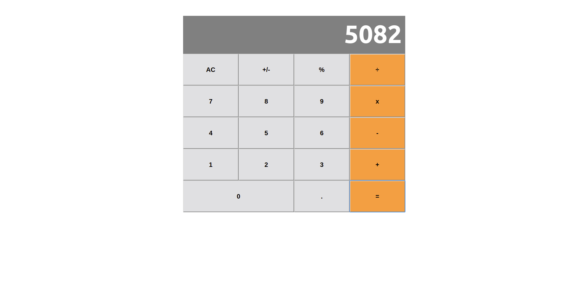

# Building a simple calculator with React

## Technologies
- Node.js
- React
- React-DOM
- React-Create-App
- npm
- CSS
- ES6

## About the Project

Math-magicians is a fictional company based in France. They want help to build a simple product that would assist them with their calculations.

## Live Version
Can be found on <a href="https://mouhadiouf.github.io/react-calculator/" target="_blank">React Calculator</a>

## Milestones

- **Milestone 1**: [Basic project structure](https://github.com/microverseinc/project-react-calculator/blob/master/milestones/MILESTONE_1.md)
- **Milestone 2**: [Components](https://github.com/microverseinc/project-react-calculator/blob/master/milestones/MILESTONE_2.md)
- **Milestone 3**: [Styling](https://github.com/microverseinc/project-react-calculator/blob/master/milestones/MILESTONE_3.md)
- **Milestone 4**: [Calculations](https://github.com/microverseinc/project-react-calculator/blob/master/milestones/MILESTONE_4.md)
- **Milestone 5**: [Event handlers](https://github.com/microverseinc/project-react-calculator/blob/master/milestones/MILESTONE_5.md)

.
## Developed by

Mouhamadou Diouf ( <a href="https://github.com/MouhaDiouf"> @mouhad </a>)

## Contributing

1. Fork it (https://github.com/MouhaDiouf/react_calculator)
2. Create your feature branch (git checkout -b feature/[choose-a-name])
3. Commit your changes (git commit -am 'What this commit will fix/add')
4. Push to the branch (git push origin feature/[chosen name])
5. Create a new Pull Request
